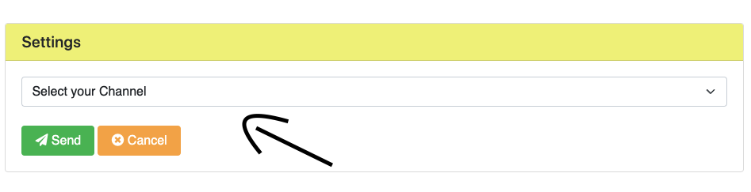
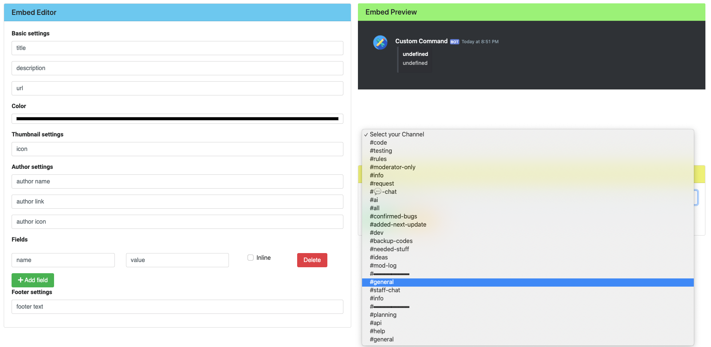

# Using the Embed Builder

When you open up the dashboard, click on the `Embed Creator` tab

Then set all custom details in the section marked with the name: `Embed Editor`

When you have done that, set a channel to send the message to. Click on the box to get a dropdown menu

In my case, I select `#general`. You can select any channel the bot can see and has perms to send messages to. (Make sure the bot has embed and image perms too, to prevent conflicts)

Then click `Send` to save it. If you want to cancel it, you click the orange button

It should look something like this:
