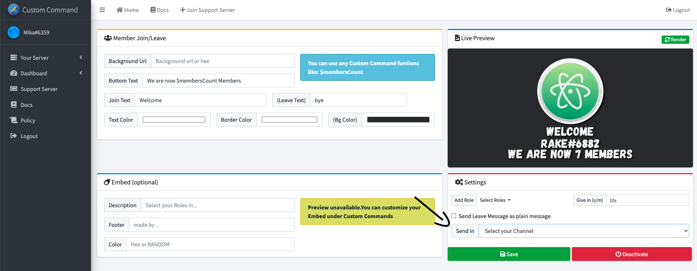
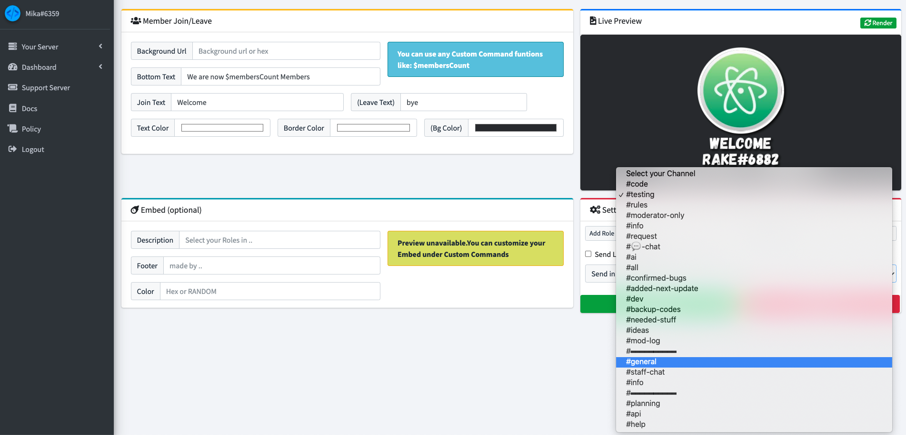
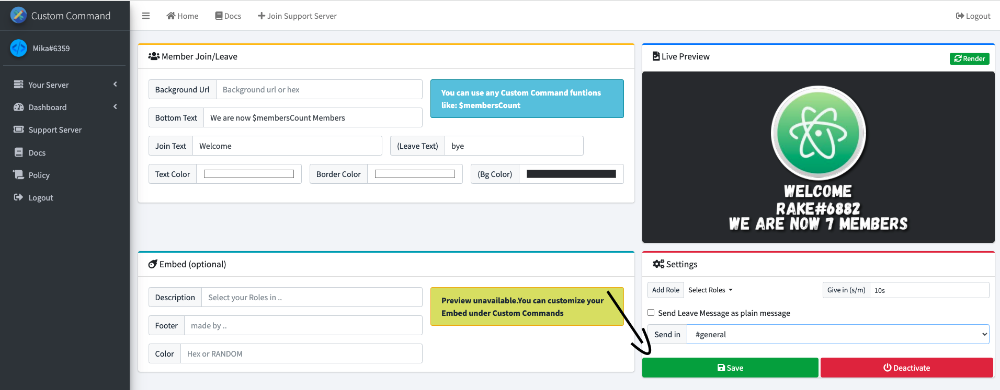

# Setting up Welcomer

When you open up the dashboard, click on the `welcomer` tab

Then set all custom details in the section marked with the name: `Member Join/Leave`

When you have done that, set a channel to send the message to. Click on the box to get a dropdown menu

In my case, I select `#general`. You can select any channel the bot can see and has perms to send messages to. (Make sure the bot has embed and image perms too, to prevent conflicts)

Then click `Save` to save it. If you want to deactivate it, you click the red button

It should look something like this:
