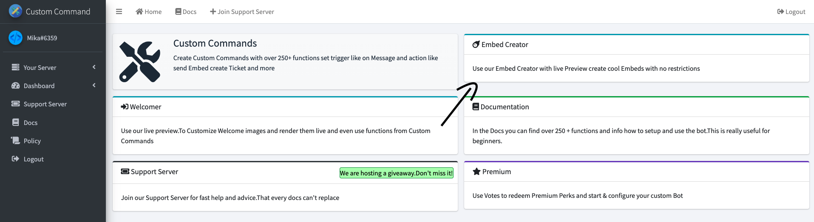
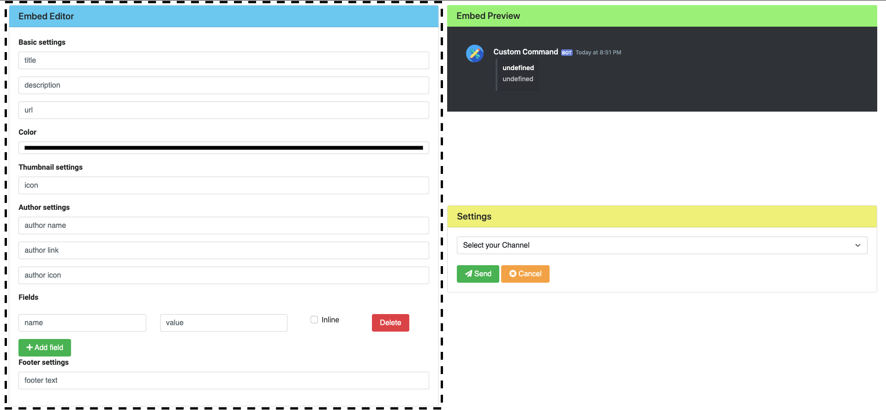
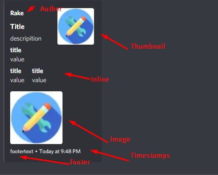
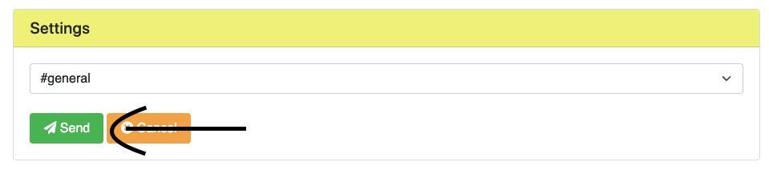
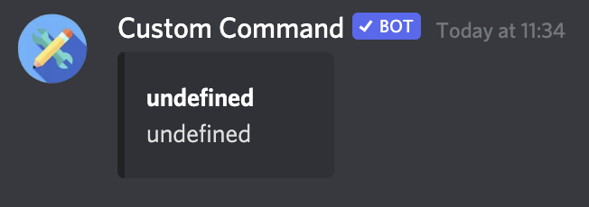

# Creating Embeds with the Embed Builder

This guide will walk you through using the Embed Builder within the dashboard to create and send custom embeds to your Discord server.

## Accessing the Embed Creator

1.  After logging into the dashboard, navigate to the `Embed Creator` tab.
    

## Customizing Your Embed

2.  In the `Embed Editor` section, you can define all the details of your embed, such as the title, description, color, fields, author, and more. Experiment with the options to create the perfect embed for your needs!
    
    

## Selecting a Destination Channel

3.  Once you've configured your embed, choose the channel where you want to send it. Click the channel selection box to reveal a dropdown menu of available channels.
    

4.  Select the desired channel. In this example, we're using `#general`.  **Important:** Ensure the bot has permission to view and send messages, including embeds and images, in the selected channel. This usually requires the "View Channel," "Send Messages," "Embed Links," and "Attach Files" permissions.
    

## Sending Your Embed

5.  To send your embed to the selected channel, click the `Send` button. If you wish to discard your changes, click the orange "Cancel" button.
    

## Success!

6.  Your embed should now appear in the chosen channel.
    

Now you can create visually appealing and informative messages for your Discord server using the Embed Builder!