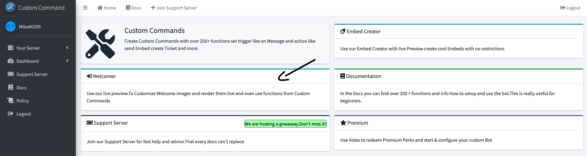
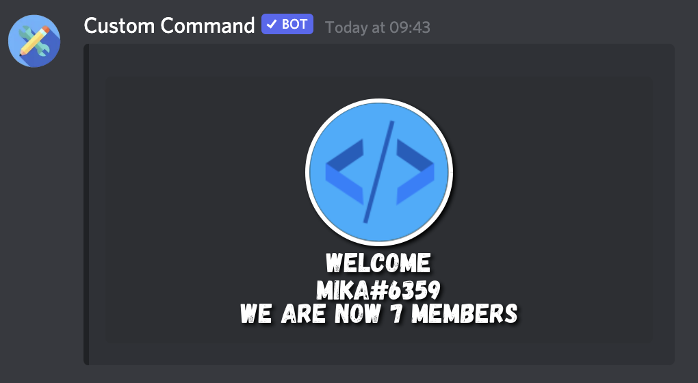

# Setting Up Welcomer

Welcome to the Welcomer setup guide! This feature allows you to automatically send a custom message when a new member joins your server or when a member leaves. Let's walk through the process step-by-step.

1.  **Access the Welcomer Tab:**

    First, navigate to the dashboard and click on the `welcomer` tab. This will bring you to the Welcomer settings page.

    

2.  **Configure Member Join/Leave Settings:**

    Within the Welcomer tab, you'll find a section labeled `Member Join/Leave`.  This is where you customize the messages for when members join or leave your server.  Set your desired custom details in this section, such as the welcome message, member goodbye message, and image.

    

3.  **Select a Channel:**

    Next, you need to specify the channel where the welcome and leave messages will be sent. Click on the channel selection box. A dropdown menu will appear, displaying the available channels.

    

4.  **Choose Your Channel:**

    Select the channel you want the messages to be sent to. In this example, `#general` is selected. You can choose any channel that your bot can *see* and has the necessary permissions to *send messages*.

    **Important:** Ensure the bot has the "Embed Links" and "Attach Files" permissions in the selected channel.  This is crucial for the bot to be able to send rich embedded messages and images without any issues.

    

5.  **Save or Deactivate:**

    *   **Save:** Once you've configured your settings and chosen a channel, click the `Save` button to save your changes. Your Welcomer feature is now active!

    *   **Deactivate:** If you want to temporarily disable the Welcomer, simply click the red "Deactivate" button.

    

6.  **Example Outcome:**

    After saving, your Welcomer configuration should look similar to this, reflecting the channel and custom settings you've chosen:

    

That's it! You've successfully configured the Welcomer feature. New members joining or members leaving will now receive your personalized messages in the specified channel. Remember to adjust the settings as needed to keep your community welcoming and engaged.